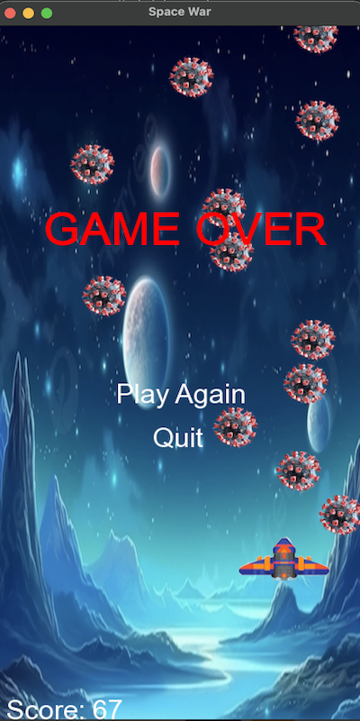

# SpaceWar 🚀

 <!-- Add a screenshot of your game here -->

**SpaceWar** is a fast-paced 2D space shooter game built using **SFML (Simple and Fast Multimedia Library)**. The game features smooth scrolling backgrounds, enemy waves, player-controlled shooting, and a scoring system. It's a fun and engaging project that demonstrates my skills in C++ programming, game development, and object-oriented design.

---

## Table of Contents
1. [Features](#features)
2. [Installation](#installation)
3. [How to Play](#how-to-play)
4. [Project Structure](#project-structure)
5. [Technologies Used](#technologies-used)
6. [Future Improvements](#future-improvements)
7. [Contributing](#contributing)
8. [License](#license)

---

## Features ✨
- **Player Controls**: Move your spaceship using the arrow keys and shoot bullets with the spacebar.
- **Enemy Waves**: Enemies spawn at regular intervals and move towards the player.
- **Collision Detection**: The game detects collisions between player bullets and enemies, as well as between the player and enemies.
- **Scoring System**: Earn points by shooting down enemies.
- **Game Over Screen**: When the player collides with an enemy, the game ends, and you can choose to restart or quit.
- **Smooth Scrolling Background**: The background scrolls seamlessly to create a dynamic space environment.

---

## Installation 🛠️

### Prerequisites
- **SFML 3.0.0** or later (install via your package manager or download from [SFML's official website](https://www.sfml-dev.org/)).
- **C++ Compiler** (e.g., GCC, Clang, or MSVC).

### Steps
1. Clone the repository:
   ```bash
   git clone https://github.com/your-username/SpaceWar.git
   cd SpaceWar
   ```
2. Compile the game using the provided `Makefile`:
   ```bash
   make
   ```
3. Run the game:
   ```bash
   ./SpaceWar
   ```

---

## How to Play 🎮
- **Move**: Use the arrow keys (`←`, `→`, `↑`, `↓`) to move your spaceship.
- **Shoot**: Press the spacebar to shoot bullets at enemies.
- **Avoid Enemies**: Don't let enemies collide with your spaceship, or the game will end.
- **Score**: Shoot down enemies to increase your score.

---

## Project Structure 📂
```
.
├── Makefile
├── assets
│   ├── Help.txt
│   ├── figures
│   │   ├── back1.jpg
│   │   ├── back2.jpg
│   │   ├── back3.jpg
│   │   ├── background1.png
│   │   ├── background2.png
│   │   ├── bullet1.png
│   │   ├── enemy1.png
│   │   ├── fighter1.png
│   │   └── fighter2.png
│   ├── fonts
│   │   └── Arial.ttf
│   └── musics
│       ├── digital-storm.wav
│       ├── gameOver.mp3
│       ├── glitch-perc-50.wav
│       └── shoot.wav
├── include
│   ├── Bullet.h
│   ├── Constants.h
│   ├── Enemy.h
│   ├── Game.h
│   └── Player.h
└── src
    ├── Bullet.cpp
    ├── Enemy.cpp
    ├── Game.cpp
    ├── Player.cpp
    └── main.cpp
```

---

## Technologies Used 💻
- **C++**: The core programming language used for game logic.
- **SFML**: Handles graphics, window management, and user input.
- **Makefile**: Simplifies the build process.
- **Git**: Version control for the project.

---

## Future Improvements 🔮
Here are some ideas for future enhancements:
- **Power-ups**: Add power-ups like shields, speed boosts, or multi-shot bullets.
- **Levels**: Introduce multiple levels with increasing difficulty.
- **Sound Effects**: Add sound effects for shooting, explosions, and background music.
- **High Score System**: Save and display the highest score achieved.
- **Mobile/Web Port**: Port the game to mobile or web platforms using a framework like Emscripten.

---

## Contributing 🤝
Contributions are welcome! If you'd like to contribute, please follow these steps:
1. Fork the repository.
2. Create a new branch for your feature or bugfix.
3. Commit your changes.
4. Submit a pull request.

---

## License 📜
This project is licensed under the **MIT License**. See the [LICENSE](LICENSE) file for details.


---

Thank you for checking out **SpaceWar**! I hope you enjoy playing it as much as I enjoyed building it. If you have any questions or feedback, feel free to reach out! 🚀
